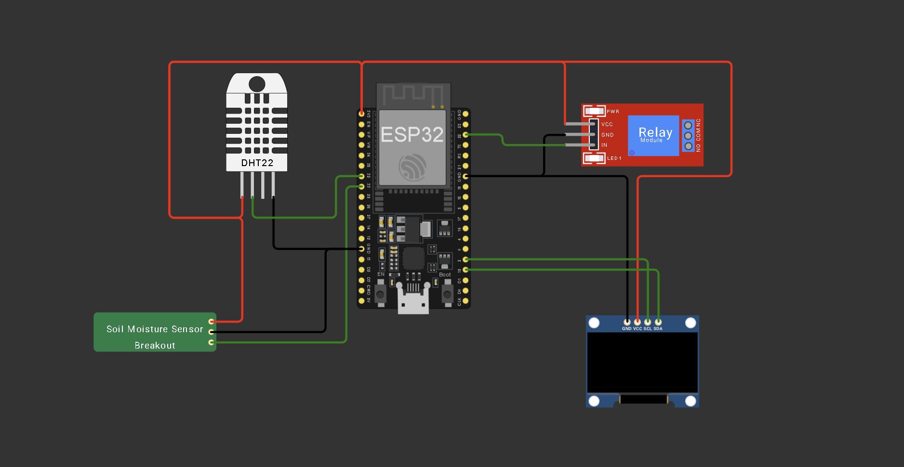
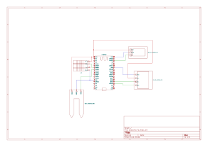

# 🌱 Smart Irrigation System

Sistem irigasi otomatis berbasis Internet of Things (IoT) menggunakan ESP32 untuk memonitor kelembaban tanah, suhu lingkungan, serta mengontrol pompa air secara otomatis.

Project ini mensimulasikan sistem penyiraman tanaman otomatis menggunakan **ESP32 pada Wokwi**, platform cloud **ThingSpeak**, dan dashboard website yang di-host menggunakan **GitHub Pages**.

---

# 📸 Tampilan Project

## Wiring Diagram (Wokwi)


## Schematic (KiCad)


---

# 📌 Deskripsi Project

Smart Irrigation System merupakan sistem yang dirancang untuk membantu proses penyiraman tanaman secara otomatis berdasarkan kondisi kelembaban tanah.

Sistem membaca:

- Kelembaban tanah menggunakan Soil Moisture Sensor
- Suhu lingkungan menggunakan sensor DHT22

Data sensor kemudian dikirimkan ke platform ThingSpeak melalui koneksi WiFi. Website dashboard mengambil data tersebut menggunakan API ThingSpeak untuk menampilkan informasi secara realtime, grafik perubahan data, riwayat pengukuran, serta fitur download data dalam format CSV.

---

# 🏗️ Arsitektur Sistem

```
+----------------------+
| Soil Moisture Sensor |
+----------+-----------+
           |
           |
+----------v-----------+
|        ESP32         |
|                      |
| - Membaca sensor     |
| - Kontrol pompa      |
| - Menampilkan OLED   |
+----------+-----------+
           |
           |
           | WiFi
           |
+----------v-----------+
|      ThingSpeak      |
|    Cloud Database    |
+----------+-----------+
           |
           |
           | REST API
           |
+----------v-----------+
|   Website Dashboard  |
|    GitHub Pages      |
+----------------------+
```

---

# ⚙️ Komponen Hardware

| Komponen | Fungsi |
|---|---|
| ESP32 | Mikrokontroler utama sistem |
| Soil Moisture Sensor | Mengukur kelembaban tanah |
| DHT22 | Mengukur suhu lingkungan |
| Relay Module | Mengontrol pompa air |
| OLED SSD1306 | Menampilkan informasi monitoring |

---

# 🔌 Konfigurasi Pin ESP32

| Komponen | Pin ESP32 |
|---|---|
| Soil Moisture Sensor | GPIO 33 |
| DHT22 SDA | GPIO 32 |
| Relay Input | GPIO 22 |
| OLED SDA | GPIO 15 |
| OLED SCL | GPIO 2 |

---

# 🔄 Alur Kerja Sistem

## 1. Pembacaan Sensor

ESP32 membaca data dari sensor secara berkala.

Data yang diperoleh:

- Nilai kelembaban tanah (%)
- Nilai temperatur (°C)

Contoh:

```
Soil Moisture : 50%

Temperature   : 24°C
```

---

## 2. Sistem Kontrol Pompa Otomatis

ESP32 menggunakan nilai kelembaban tanah sebagai dasar pengambilan keputusan.

Logika kontrol:

```
Jika kelembaban tanah < 15%

    Pompa ON


Jika kelembaban tanah > 85%

    Pompa OFF
```

Dengan sistem ini, tanaman dapat memperoleh air ketika kondisi tanah terlalu kering.

---

## 3. Tampilan OLED

OLED SSD1306 digunakan untuk menampilkan kondisi sistem secara langsung.

Tampilan:

```
--- MONITORING ---

Soil Moist: 50 %

Temp      : 24 C

Pump      : OFF
```

---

## 4. Pengiriman Data ke Cloud

ESP32 mengirimkan data sensor ke ThingSpeak menggunakan koneksi WiFi.

Data dikirim setiap 16 detik karena mengikuti batas maksimal update pada akun ThingSpeak gratis.

Mapping data:

| ThingSpeak Field | Data |
|---|---|
| Field 1 | Soil Moisture |
| Field 2 | Temperature |
| Field 3 | Status Pompa |

---

## 5. Website Dashboard

Website mengambil data dari ThingSpeak menggunakan REST API.

Fitur dashboard:

### Monitoring Realtime

Menampilkan:

- Kelembaban tanah
- Suhu
- Status pompa


### Grafik Data

Menampilkan perubahan:

- Grafik kelembaban tanah
- Grafik temperatur


### Data Logging

Website menampilkan histori pengukuran.

Contoh:

```
Waktu       Soil    Suhu    Pompa

08:00       50      24      OFF

08:16       52      24      OFF

08:32       48      25      ON
```


### Download CSV

Data histori dapat diunduh dalam bentuk file CSV untuk analisis lebih lanjut.

Contoh:

```
irrigation_data.csv
```

---

# 💻 Software yang Digunakan

| Software | Kegunaan |
|---|---|
| Wokwi | Simulasi ESP32 |
| Arduino IDE | Pemrograman ESP32 |
| ThingSpeak | Penyimpanan data IoT |
| GitHub Pages | Hosting website |
| Chart.js | Membuat grafik dashboard |

---

# 📂 Struktur Project

```
Smart-Irrigation-iot

│
├── ESP32
│   ├── main.ino
│   ├── diagram.json
│   ├── diagram-soil-moisture-sensor.json
│   ├── soil-moisture-sensor.c
│   └── libraries.txt
│
├── images
│   ├── kicad-schematic.png
│   └── wokwi-schematic.png
├── index.html
│
├── style.css
│
├── script.js
│
└── README.md
```

---

# 🚀 Cara Menjalankan Project

## ESP32 (Wokwi)

1. Buka project pada Wokwi.
2. Jalankan simulasi.
3. Buka Serial Monitor.
4. Pastikan muncul:

```
WiFi Connected

Upload Success
```

5. Data akan masuk ke ThingSpeak.

---

## Website Dashboard

Website dapat diakses melalui GitHub Pages:

```
https://babagas.github.io/smart-irrigation-iot/
```

Website akan otomatis mengambil data terbaru dari ThingSpeak.

---

# 📊 Output Sistem

Dashboard menampilkan:

```
Smart Irrigation System

Soil Moisture
50 %

Temperature
24 °C

Pump Status
OFF
```

---
Dibuat menggunakan:
- ESP32
- DHT22
- Soil Moisture Sensor
- ThingSpeak
- Web Dashboard

Honorable Mention:
ChatGPT 
